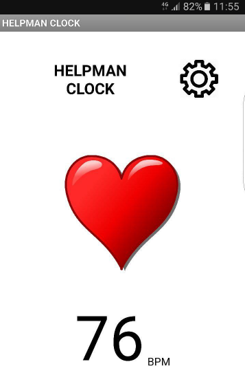
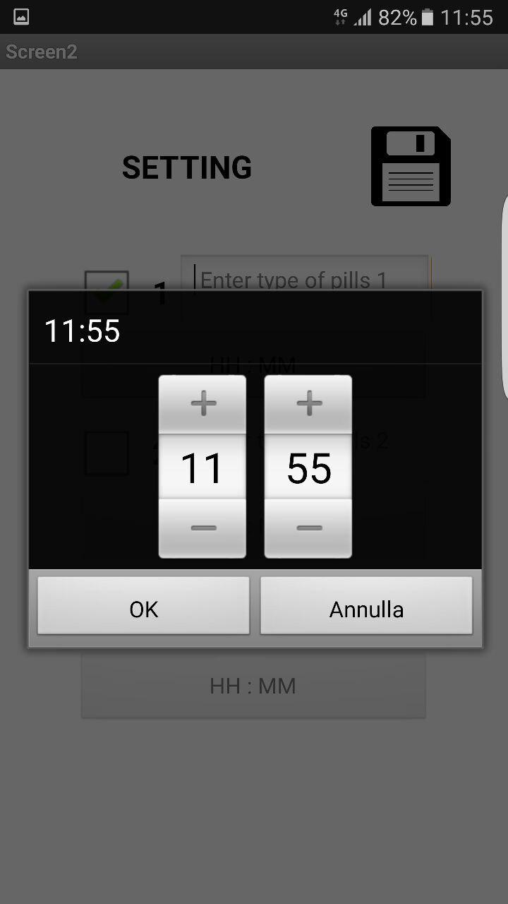
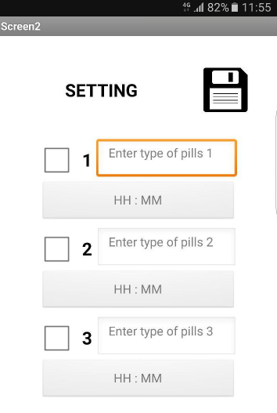

#HELPMAN CLOCK

##FABLAB PALERMO - MAKEIT INTEL CONTEST - FABLAB TOUR

###makerfaire roma 2016

####more info  
Instructables @ _http://www.instructables.com/id/HELPMAN-CLOCK/?ALLSTEPS_  
Intel DevMesh @ _http://www.intel.it/content/www/it/it/events/progetti-helpman-clock.html_  
Youtube @ _https://www.youtube.com/watch?v=3aIBsPesC3Q_

Il progetto **HELPMAN** è composto da un **CLOCK**, un **DISPENSER** e una **APP ANDROID**.

**HELPMAN CLOCK**  
Il codice si trova nella directory _clock_  
Firmware per Arduino Nano + LCD Nokia5110 + HC05 + DFplayer MiniMP3

**HELPMAN DISPENSER**  
Il codice si trova nella directory _dispenser_  
Python script per Intel Edison  
Bash script wrapper da inserire in crontab @reboot per l'avvio automatico dell'applicazione.  

**HELPMAN ANDROID APP**  
Il codice si trova nella directory android_app  
creata con App Inventor _http://appinventor.mit.edu/explore/_  
All'interno della cartella trovate anche l'APK per installare l'app sul vostro smartphone Android.

**IMPORTANTE!!!**  
Customizzare prima dell'uso  
_dispenser/btconnect.sh_ AND _dispenser/btdisconnect.sh_  
Inserisci qui dentro il mac address del device bluetooth  
*ADDRESS="00:00:00:00:00:00"*

_dispenser/readconfig.py_ AND _dispenser/savedata.py_  
Inserisci qui l'url dello spreadsheet google  
*url="https://docs.google.com/spreadsheets/blablabla"*

Lo stesso URL va configurato all'interno dell'APP helpman clock per ANDROID  
tramite le opzioni di configurazione, insieme alle API. [in fase di building]  

## Screenshots

<a href="">Android App</a>

